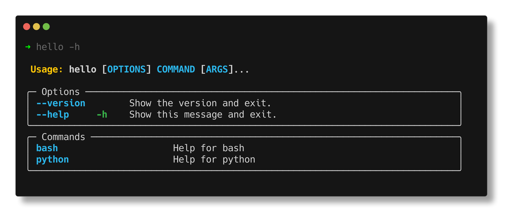

[](https://github.com/jaykv/cliffy/actions)
[](https://pypi.org/project/cliffy/)


# cliffy :mountain:
cliffy is a YAML-defined CLI generator, manager, and builder for Python. It offers features to rapidly build, test, and deploy CLIs.

## Features
* Write CLIs with YAML manifests
* Manage CLIs- load, test, update, list, and remove
* Built-in shell and Python scripting support
* Supports Jinja2 templating
* Hot-reload CLIs on manifest changes for easier development
* Build CLIs into self-contained, single-file portable zipapps for sharing

### Load

1. Define a manifest
```yaml
# hello.yaml
name: hello
version: 0.1.0

commands:
  bash: $echo "hello from bash"
  python: print("hello from python")
```

2. Load CLI
```
$ cli load hello.yaml
```
Parses `hello.yaml` to generate a Typer CLI and load it into the running Python environment.

3. Run CLI directly

`hello -h`



For more examples, check [examples](examples/) directory.

### Build

1. Define a manifest
```yaml
# requires.yaml
name: requires
version: 0.1.0

requires:
  - requests >= 2.30.0
  - six

imports:
  - import six

commands:
  bash: $echo "hello from bash"
  python: print("hello from python")
  py: |
    if six.PY2:
        print("python 2")
    if six.PY3:
        print("python 3")
```

2. Build CLI
```
$ cli build requires.yaml -o dist
```

Builds a portable zipapp containing the CLI and its package requirements.

3. Run CLI
```
./dist/requires -h
```

## Usage
`cli <command>`
* `init <cli name> --raw`: Generate a template CLI manifest for a new CLI
* `load <manifest>`: Add a new CLI based on the manifest
* `render <manifest>`: View generated CLI script for a manifest
* `list` or `ls`: Output a list of loaded CLIs 
* `update <cli name>`: Reload a loaded CLI
* `remove <cli name>` or `rm <cli name>`: Remove a loaded CLI
* `run <manifest> -- <args>`: Runs a CLI manifest as a one-time operation
* `build <cli name or manifest>`: Build a CLI manifest or a loaded CLI into a self-contained zipapp
* `info <cli name>`: Display CLI metadata
* `dev <manifest>`: Start hot-reloader for a manifest for active development

## How it works
1. Define CLI manifests in YAML files
2. Run `cli` commands to load, build, and manage CLIs
3. When loaded, cliffy parses the manifest and generates a [Typer](https://github.com/tiangolo/typer) CLI that is deployed directly as a script
4. Any code starting with `$` will translate to subprocess calls via [PyBash](https://github.com/cliffy-sh/pybash)
5. Run loaded CLIs straight from the terminal
6. When ready to share, run `build` to generate portable zipapps built with [Shiv](https://github.com/linkedin/shiv)

## Install
* `pip install "cliffy[rich]"` to include [rich-click](https://github.com/ewels/rich-click) for colorful CLI help output formatted with [rich](https://github.com/Textualize/rich).

or 

* `pip install cliffy`

## Manifest template
Generated by `cli init`. For a barebones template, run `cli init --raw`
```yaml
# cliffy v1 template
manifestVersion: v1

# The name of the CLI
# This will be used as the script name when invoking the CLI from the command line.
name: cliffy 

# The version of the CLI
# This should follow the standard semantic versioning format (e.g., 'MAJOR.MINOR.PATCH').
version: 0.1.0

# List of external CLI manifest paths to include into the main manifest
# Performs a deep merge of manifests sequentially in the order given to assemble a merged manifest
# and finally, deep merges the merged manifest with the main manifest.
includes: []

# List of Python dependencies required for the CLI
# Validated on CLI load and update
# Supports basic requirements specifier syntax.
requires: []

# A mapping defining manifest variables that can be referenced in any other blocks
# Environments variables can be used in this section with ${some_env_var} for dynamic parsing
# Supports jinja2 formatted expressions as values
# Interpolate defined vars in other blocks jinja2-styled {{ var_name }}.
vars:
    default_mood: happy

# A string block or list of strings containing any module imports
# These can be used to import any python modules that the CLI depends on.
imports:
    - import os
    - |
        from collections import defaultdict
        import re

# A list containing any helper functions
# Each element of the list can be a separate function
# These functions should be defined as strings that can be executed by the Python interpreter.
functions:
    - |
        def greet_name(name: str):
            print("hello " + name)

# A mapping containing any shared type definitions
# These types can be referenced by name in the args section to provide type annotations for params and options defined in the args section.
types:
    Language: str = typer.Option("english", "-l", help="Language to greet in", prompt=True)

# A mapping containing the arguments and options for each command
# Each key in the mapping should correspond to a command in the commands section
# The value should be a list of mappings representing the params and options for that command.
args:
    world: [--name|-n: str!]                      # a REQUIRED option
    greet.all: 
        - names: str!                             # a REQUIRED param as denoted by the ! at the end
        - mood: str = "{{default_mood}}"          # an OPTIONAL param that uses a manifest var as default
        - --language: Language                    # an option with a default that uses Language type as arg definition

# A mapping containing the command definitions for the CLI
# Each command should have a unique key- which can be either a group command or nested subcommands
# Nested subcommands are joined by '.' in between each level
# A special (*) wildcard can be used to spread the subcommand to all group-level commands
# The value is the python code to run when the command is called OR a list of bash commands to run (prefixed with $).
commands:
    # this is a parent command that will get invoked with: hello world
    world: 
        - |
            """
            Help text for list
            """
            greet_name("world")
        - $ echo "i can also mix-and-match this command script to run bash commands"
    
    # this is a nested command that will get invoked with: hello greet all
    greet.all: 
        - help: Help text for list.all       # you can also define help text like this
        - $ echo "hello all"                 # this is a bash command that will get converted to python subprocess call
        - print("greetings from python")     # this python code will get directly invoked

```

## Development
```
poetry shell
cli -h
```
