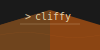

<style>
.md-content .md-typeset h1 { display: none; }
</style>

# Cliffy



Build feature-rich Python CLIs  _quickly_.

!!! example "Simplest example"
    1. Define a manifest
    ```yaml
    # hello.yaml
    name: hello
    version: 0.1.0
    help: Hello world!

    commands:
      shell: $echo "hello from shell"
      python: print("hello from python")
    ```

    2. Load CLI
    ```
    $ cli load hello.yaml
    ```
    `hello.yaml` automatically gets parsed to generate a Typer CLI and gets loaded into the running Python environment.

    3. Run CLI directly

    

    For more examples, check [examples](examples/) directory.

!!! example "Build into single-file executable"
    Simple todo CLI with sqlite3 + tabulate.

    ```yaml
    # todo.yaml
    name: todo
    version: 1.0.0
    requires:
       - tabulate  # For pretty table output
       - rich      # For colored terminal output
    imports: |
      import sqlite3
      from pathlib import Path
      from tabulate import tabulate
      from rich import print

    commands:
      create:
        help: Create a new database with tasks table
        params:
        - name: str = typer.Option(..., prompt=True, confirmation_prompt=True)
        run: |
        db_path = Path(f"{name}.db")
        conn = sqlite3.connect(db_path)
        conn.execute("CREATE TABLE tasks (id INTEGER PRIMARY KEY, task TEXT NOT NULL, done BOOLEAN NOT NULL)")

        # insert example tasks
        conn.execute("INSERT INTO tasks (task, done) VALUES ('Fight for your right!', 0)")
        conn.execute("INSERT INTO tasks (task, done) VALUES ('To party!', 1)")
        conn.commit()
        conn.close()
        print(f"✨ Created database {db_path} with tasks table")

      tasks:
        help: List tasks in database
        params: [name: str!]
        run: |
        conn = sqlite3.connect(f"{name}.db")
        cursor = conn.execute("SELECT * FROM tasks")
        tasks = cursor.fetchall()
        conn.close()
        print(tabulate(tasks, headers=['ID', 'Task', 'Done'], tablefmt='grid'))

      add:
        help: Add a new task
        params: [name: str!, task: str!]
        run: |
        conn = sqlite3.connect(f"{name}.db")
        conn.execute("INSERT INTO tasks (task, done) VALUES (?, 0)", (task,))
        conn.commit()
        conn.close()
        print(f"📝 Added task: {task}")

      complete:
        help: Mark a task as complete
        params: [name: str!, id: int!]
        run: |
        conn = sqlite3.connect(f"{name}.db")
        conn.execute("UPDATE tasks SET done = 1 WHERE id = ?", (id,))
        conn.commit()
        conn.close()
        print(f"🎉 Marked task {id} as complete")
    ```

    

For more examples, check [examples](examples/) directory.

## Why cliffy
* Mix Python and shell commands naturally
* Hot-reload changes as you develop
* Package your CLI as a single executable with `cli build`
* Test your CLIs with built-in test runner
* Use Jinja2 template syntax for dynamic command generation
* Reusable command templates
* LLM-friendly schema- see [custom prompt](features#llm-friendly-prompt)

**Similar frameworks**

- [Bashly](https://github.com/DannyBen/bashly) - An awesome YAML to Bash CLI builder
- [Fire](https://github.com/google/python-fire) - Python objects to CLI builder